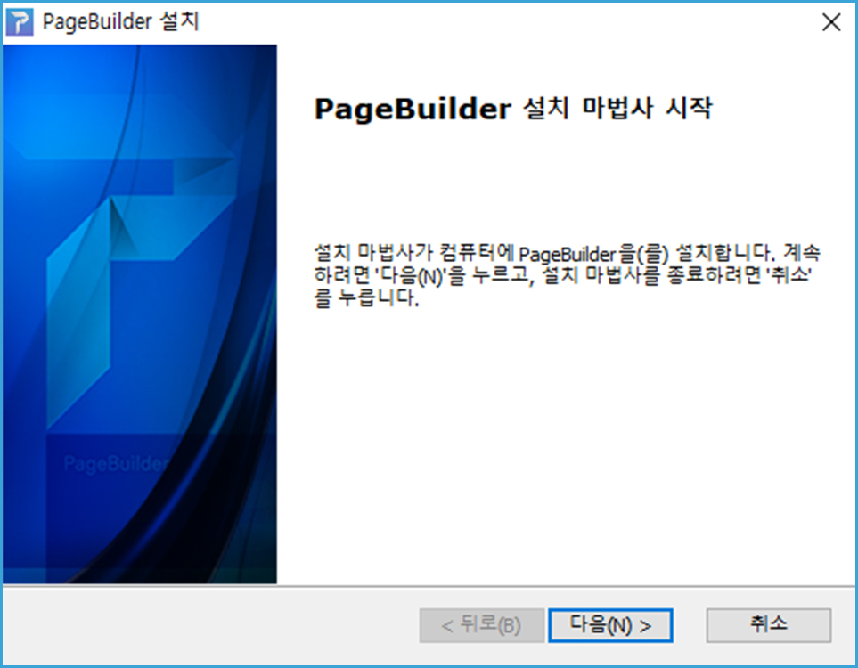
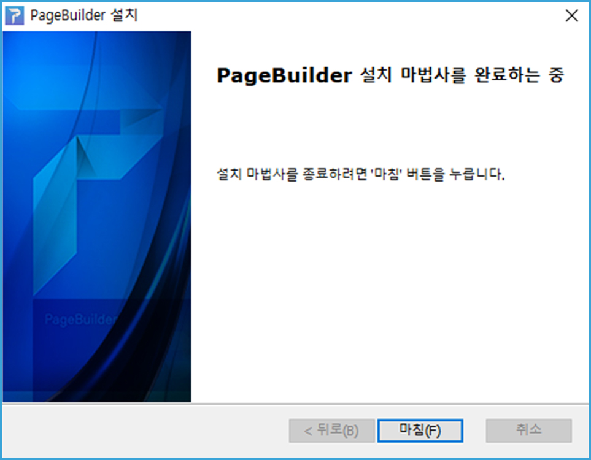
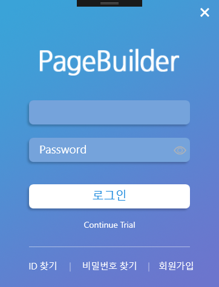
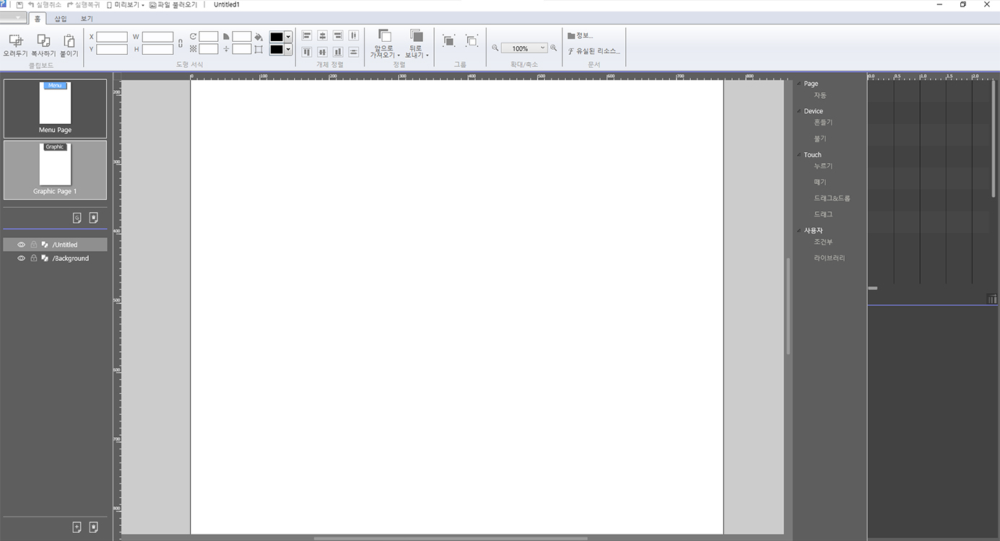
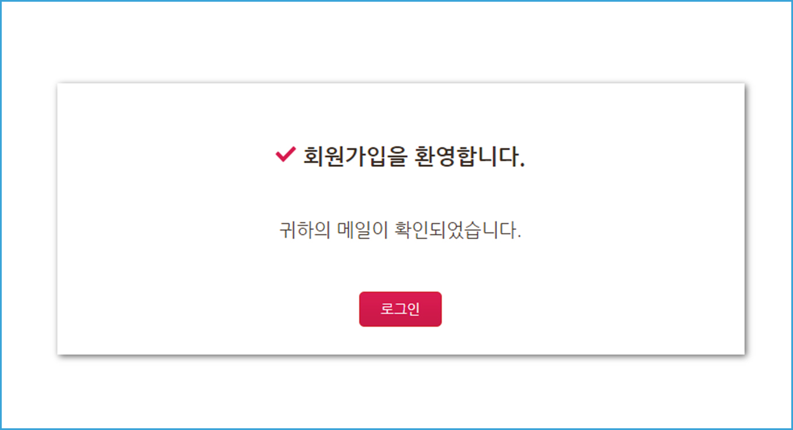

# 2. 페이지 빌더 설치하기

## 페이지빌더 설치 환경

* Operating System: Window7 이상
* Memory: 최소4G, 권장 8G 이상
* Framework: Microsoft .Net Framework 4.6.1 이상
* Library: Microsoft Visual C++ 2013 Redistributable

## 설치 따라하기 

1. Page Builder.exe 실행 파일을 더블클릭합니다.  
 

2. 설치 시작 화면에서 <button name="button">다음(N)></button>을 클릭합니다.  
  

3. 설치될 폴더를 지정한 후  <button name="button">다음(I)></button>을 클릭합니다.  
  

4. 다음 화면에서 <button name="button">설치(N)></button>을 클릭합니다.  
  

5. <button name="button">마침(F)></button>을 클릭합니다.  
  

## 페이지빌더 실행

시작 메뉴를 클릭하여 앞에서 설치한 페이지빌더를 찾아 클릭하면 프로그램이 실행됩니다. 실행 후 로그인 창이 열립니다.

아이디와 패스워드를 입력한 후, 로그인을 클릭합니다. 만약, 아이디와 패스워드가 없을 경우, 'Continue Trial' 를 눌러서 사용 할 수 있습니다.  

   

  
  

   

   ## 회원가입 하기

1. 로그인 화면에서 '회원가입'을 선택합니다. 
   
   

2. 회원가입 정보를 입력합니다.  

   

3. 회원가입 시 입력한 메일 주소에서 이메일 인증 메일을 확인합니다.  

   

4. 메일 확인 후, 로그인을 하면 회원가입이 완료된 것을 볼 수 있습니다.  

   

