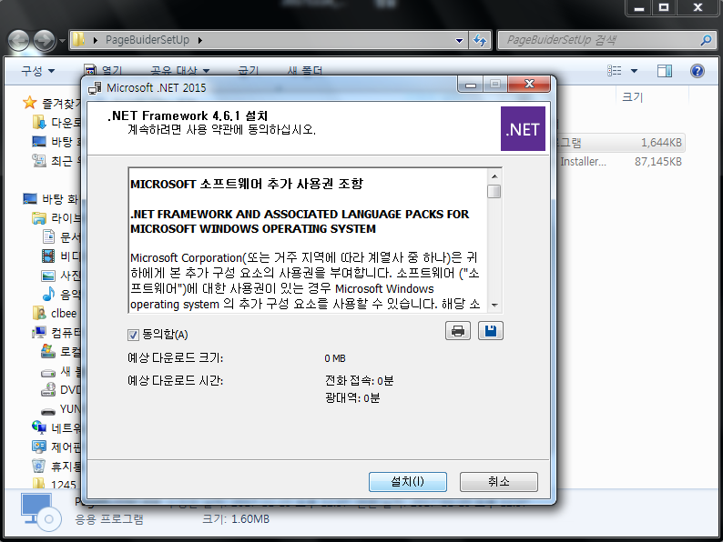
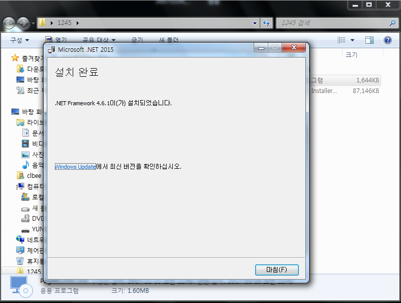

# 페이지빌더 설치

## 설치 환경

* Operating System: Window7 이상
* Memory: 최소4G, 권장 8G 이상
* Framework: Microsoft .Net Framework 4.6.1 이상
* Library: Microsoft Visual C++ 2013 Redistributable

## 설치 따라하기 

1. Page Builder.exe 실행파일을 클릭합니다.
   
   

2. 설치 시작 화면에서 <button name="button">다음(N)></button>을 클릭합니다.

3. 다음 화면에서 <button name="button">다음(N)></button>을 클릭합니다.

   

4. '동의함(A)'를 체크하고  <button name="button">설치(I)></button>을 클릭합니다.

   

5. <button name="button">마침(F)></button>을 클릭합니다.

## 설치한 프로그램 실행

시작 메뉴를 클릭하여 앞에서 설치한 페이지빌더를 찾아 클릭하면 프로그램이 실행됩니다.

   

  
   
