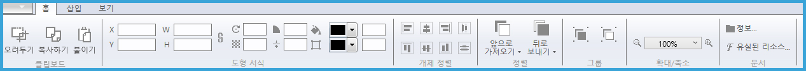
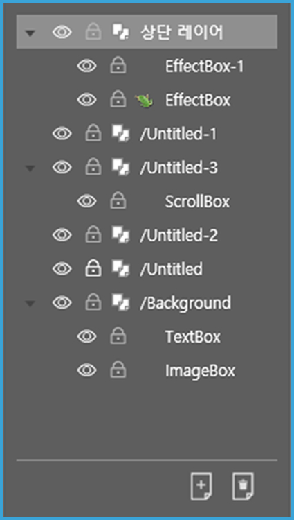
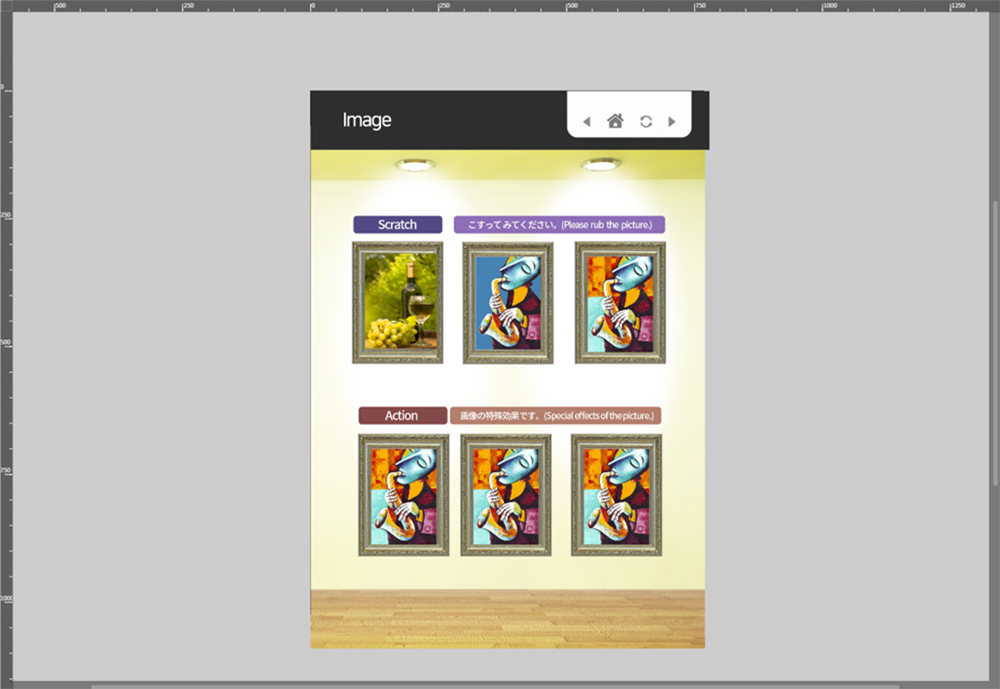
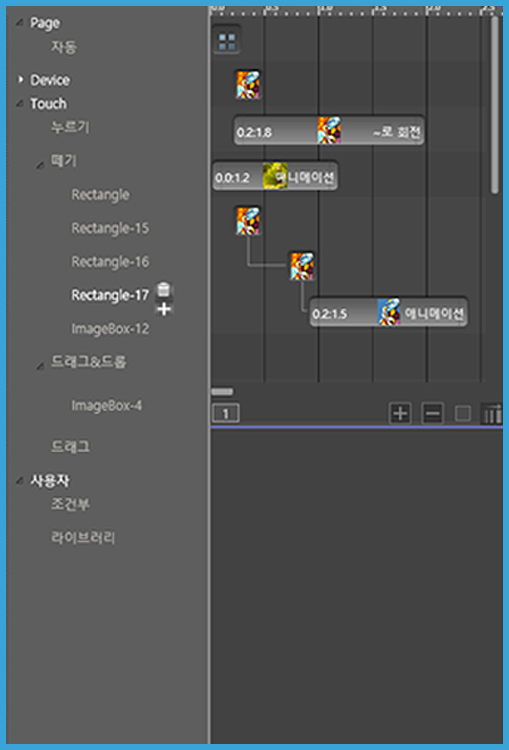

# 3. 작업 영역 살펴보기

## 작업 영역 및 패널

페이지빌더는 다음 화면과 같이 6개의 주요 작업 영역으로 구성됩니다. 
화면 구성이 직관적이고 간단하므로 초보 사용자도 쉽게 사용할 수 있습니다. 
숙련된 사용자는 고급 기능을 사용하여 더 빠른 편집을 할 수 있습니다.

### ① 빠른 실행 도구 모음

빠른 실행 도구 모음은 화면 최상단에 위치합니다. 
빠른 실행 도구 모음에는 저장, 실행 복귀, 실행 취소, 미리보기, 파일 불러오기 같은 사용자가 자주 사용하는 도구가 있습니다. 

### ② 컨트롤 패널

컨트롤 패널은 화면 상단에 위치합니다. 컨트롤 패널에는 객체를 세부적으로 편집할 때 사용하는 기능들을 담고 있습니다. 예를 들어, 객체의 크기와 위치를 조절하는 기능과 색상을 변경하는 속성이 있습니다. 

### ③ 페이지 패널

페이지 패널에서는 페이지 윤곽이 보이는 썸네일 이미지의 목록을 볼 수 있습니다.
드래그로 페이지 순서를 재배치할 수 있으며, 페이지를 추가하거나 삭제할 수 있습니다. 

### ④ 레이어 패널

레이어 패널에서는 레이어를 편리하게 구성하고 관리할 수 있습니다. 
페이지별 레이어 목록 확인과 레이어 추가, 삭제를 할 수 있습니다. 또한, 앞의 눈 아이콘을 클릭하면 작업창에서 레이어를 숨기거나 보이게 할 수 있고, 
앞의 자물쇠 아이콘을 누르시면 레이어 이동을 잠그거나 풀 수 있습니다.   

### ⑤ 작업창

작업창은 화면 중앙에 위치하며 사용자가 편집하는 영역입니다. 작업 영역에 그려진 객체들은 최종 출력에서도 보입니다. 예를 들면 작업 영역 밖에서부터 작업 영역 안쪽으로 이동하는 객체 애니메이션은 이 영역에서만 보입니다. 그리드와 가이드라인을 적절하게 사용하면 편집에 도움을 받을 수 있습니다.

### ⑥ 액션 패널

액션 패널은 객체에 동작 효과 또는 사용자 인터랙션을 줄 수 있는 작업 영역입니다. 
적용된 효과를 객체별로 타임라인에서 볼 수 있습니다. 예를 들면 객체를 시간별로 이동하거나 회전하기, 깜박거리는 효과를 줄 수 있습니다. 

 

-----------

## 파일 메뉴

페이지 빌더의 유일한 메뉴는 파일 메뉴입니다. 파일 메뉴에는 파일 생성, 저장, 내보내기 등의 기능이 있습니다. 
이 절에서는 파일 메뉴의 목차별로 기능을 설명합니다.

화면 상단의 파일 메뉴를 클릭하면 다음과 같은 메뉴 목록이 나타납니다.

### ① 새로만들기

새로만들기는 새로 작업을 시작합니다. 다음 대화상자에서 작업영역의 크기와 용지 방향을 지정할 수 있습니다. 설정을 완료하면 [확인]을 클릭합니다.

### ② 열기

저장된 페이지빌더 파일(확장자.pb)을 열 수 있습니다.

### ③ 최근 파일

최근에 작업한 파일의 목록을 볼 수 있습니다.

### ④~⑤ 저장 / 다른이름으로 저장

작업한 내용을 파일로 저장합니다.
페이지 빌더는 내부에서 효과적인 작업을 위해 자체적인 파일 포맷을 사용합니다. 
문서의 내용뿐만 아니라 문서 정보, 레이어와 같은 편집 정보를 저장합니다. 

파일 확장자는 .pb입니다.

### ⑥ 패키지 파일로 저장

저장 위치와 폴더 이름을 설정한 후 저장을 누르면 _pkg.pb와 작업에 사용한 모든 리소스가 [파일명]_Package 폴더에 저장됩니다. 동시에 zip 파일이 같이 생성됩니다. 

### ⑦ 앱 만들기

작업한 문서를 안드로이드 또는 IOS 앱 형태로 만들어 페이지빌더 서버에 업로드합니다. (페이지빌더 서버 환경은 별도의 설정이 필요합니다) 

### ⑧ 앱 결과 보기

내보낸 앱의 정보를 확인할 수 있습니다.
운영체제, 수정일, 식별자, 화면 표시 이름으로 검색을 할 수 있습니다.
[갱신]을 클릭하면 앱 만들기 창이 열리고 정보를 수정할 수 있습니다.

### ⑨ PDF가져오기

PDF가져오기 메뉴에서는 pdf 파일을 불러올 수 있습니다.
가져온 페이지는 페이지빌더의 개별 페이지에 배치됩니다.
(이미지 형태로 가져오므로 PDF 객체의 편집은 불가능합니다)

### ⑩ 내보내기

내보내기 기능에는 [썸네일 내보내기]와 [HTML5 내보내기]가 있습니다.

[썸네일 내보내기]를 사용하면 작업한 페이지가 PNG파일로 내보내집니다. 전체 페이지 혹은 부분 페이지를 내보낼 수 있습니다. 또한 내보낼 이미지의 크기를 조절할 수 있으며, 비율을 변경하면 이미지 크기에 영향을 줍니다. 

[HTML5 내보내기]에서는 작업한 문서가 [파일명] 폴더가 내보내집니다. 동시에 zip 파일도 생성됩니다. 

내보낸 후 파일명/pb.html을 더블클릭하면 웹 브라우저에서 바로 실행할 수 있습니다. 또한 페이지빌더 서버(R)를 통해 iOS와 Android App으로도 배포할 수 있습니다.

### ⑩ 페이지빌더에 관하여 / 환경설정

페이지빌더의 버전 정보를 확인할 수 있습니다.

[작업환경 탭]에서는 스냅영역, 안내선 위치와 색상을 설정할 수 있습니다.

[문서 정보 탭]에서는 문서의 정보를 설정합니다. 파일명이 비어있을 경우 html 파일명은 페이지 번호순으로 생성됩니다.

