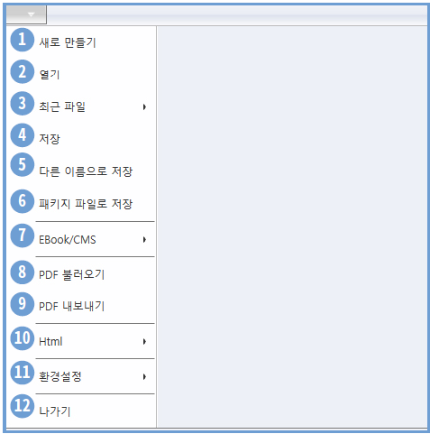

## 파일 다루기

페이지 빌더는 내부에서 효과적인 작업을 위해 자체적인 파일 포맷을 사용합니다. 여러 페이지들을 저장할 수 있으며 편집과 관련된 설정도 저장합니다. 

페이지 빌더 파일은 HTML5 형식으로 내보내어 브라우저에서 바로 실행할 수 있습니다. 또한 페이지빌더 서버(R)를 통해 iOS와 Android App으로도 배포할 수 있습니다.

### 파일 메뉴

