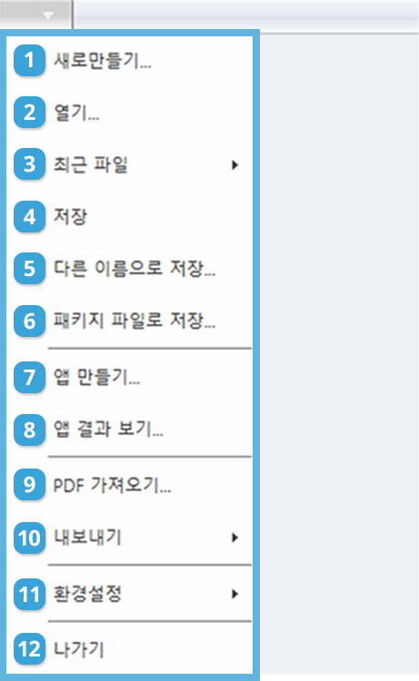

## 파일 다루기

페이지 빌더는 내부에서 효과적인 작업을 위해 자체적인 파일 포맷을 사용합니다. 여러 페이지들을 저장할 수 있으며 편집과 관련된 설정도 저장합니다. 

페이지 빌더 파일은 HTML5 형식으로 내보내어 크롬 브라우저에서 바로 실행할 수 있습니다. 또한 페이지빌더 서버(R)를 통해 iOS와 Android App으로도 배포할 수 있습니다.

파일 메뉴

### ① 새로 만들기

새로 작업을 시작합니다. 이 곳에서 작업영역의 크기와 용지 방향을 지정할 수 있습니다. 설정이 끝나면 [확인] 을 클릭합니다

 <교정: 페이지 수 그래픽/텍스트 페이지 선택은 없음>

### ② 열기

저장된 페이지빌더 파일(확장자 .pb)을 열 수 있습니다.

### ③ 최근 파일

최근에 작업한 파일의 목록을 볼 수 있습니다.

### ④~⑤ 저장 / 다른이름으로 저장

작업한 문서를 저장합니다. 페이지빌더는 자체의 파일 포맷으로 저장합니다. 확장자는 .pb입니다.

### ⑥ 패키지 파일로 저장

저장 위치와 폴더 이름을 설정한 후 저장을 누르면 _pkg.pb와
모든 리소스들이 폴더에 저장됩니다.

### ⑦ 앱 만들기

엡만들기 내용으로 수정하기

### ⑧ 앱 결과 보기

앱 결과 보기 내용 적기

### ⑨ PDF가져오기

PDF가져오기 메뉴에서는 pdf 파일을 불러올 수 있습니다.
가져온 페이지는 페이지빌더의 개별 페이지에 배치됩니다.

### ⑩ 내보내기

썸네일 저장하기 내용 업뎃 

"썸네일 저장하기" 와 "HTML5 내보내기"를 한번에 수행합니다. 
[파일명]_Html 폴더, [파일명]_Html zip파일, [파일명]_Package 폴더,
[파일명]_Package zip파일 을 생성됩니다.

내용 수정하기 

### ⑩ 페이지빌더에 관하여 / 환경설정

페이지빌더의 버전 정보를 확인할 수 있습니다.

작업환경 탭에서는 스냅영역, 안내선 위치와 색상을 설정합니다.

문서 정보 탭에서는 문서의 정보를 설정합니다. 파일명이 비어있을 경우 html파일명은 페이지 번호순으로 생성됩니다.

