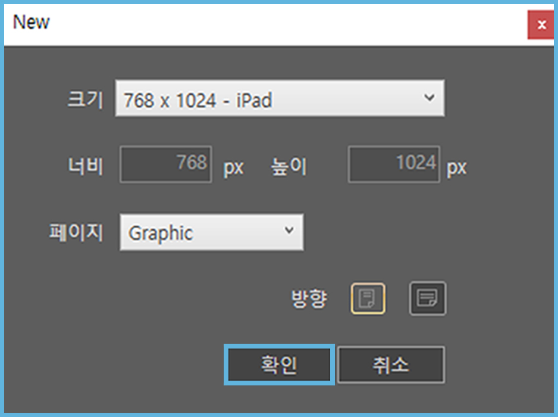
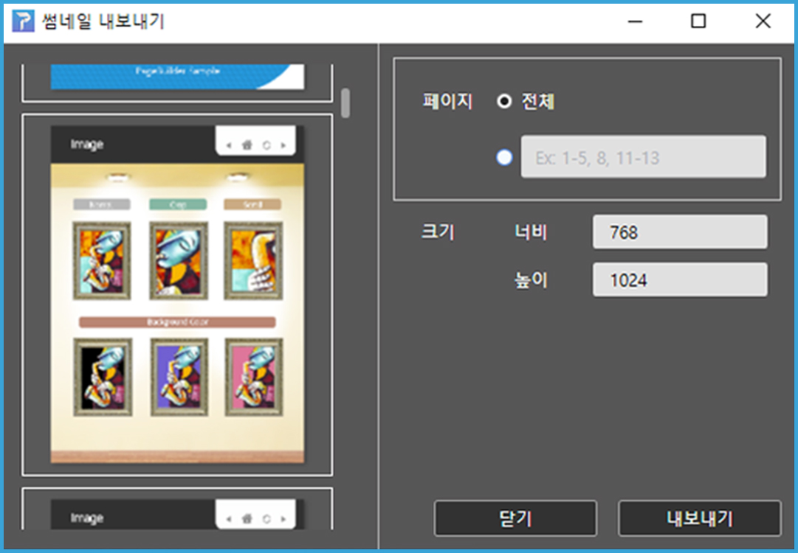
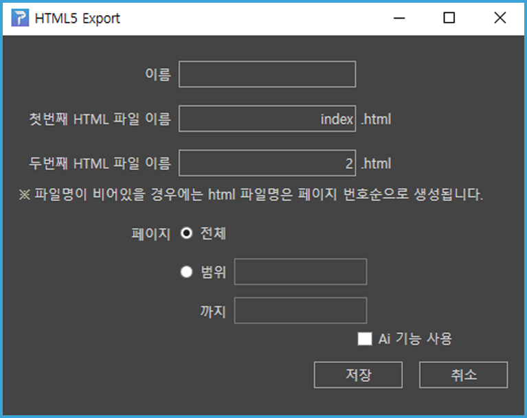

## 3-2. [파일] 메뉴 설명

페이지 빌더는 내부에서 효과적인 작업을 위해 자체적인 파일 포맷을 사용합니다. 문서의 내용 뿐만 아니라 페이지 레이이웃, 레이어, 룰러와 가이드와 같은 사용자 편집 환경을 저장합니다. 

페이지 빌더 파일은 HTML5 형식으로 내보내어 크롬 브라우저에서 바로 실행할 수 있습니다. 또한 페이지빌더 서버(R)를 통해 iOS와 Android App으로도 배포할 수 있습니다.

이 절에서는 파일 메뉴의 목차 별로 기능을 설명합니다.

## 파일 메뉴

화면 상단의 파일 메뉴를 클릭하면 다음과 같은 메뉴 목록이 나타납니다.

### ① 새로만들기

새로만들기는 새로 작업을 시작합니다. 다음 대화상자에서 작업영역의 크기와 용지 방향을 지정할 수 있습니다. 설정을 완료하면 [확인] 을 클릭합니다.

 

 

### ② 열기

저장된 페이지빌더 파일(확장자.pb)을 열 수 있습니다.

### ③ 최근 파일

최근에 작업한 파일의 목록을 볼 수 있습니다.

### ④~⑤ 저장 / 다른이름으로 저장

작업한 문서를 저장합니다. 페이지빌더는 자체의 파일 포맷으로 저장합니다. 확장자는 .pb입니다.

### ⑥ 패키지 파일로 저장

저장 위치와 폴더 이름을 설정한 후 저장을 누르면 _pkg.pb와 작업에 사용한 모든 리소스들이 [파일명]_Package 폴더에 저장됩니다. zip 파일이 동시에 생성됩니다. 

### ⑦ 앱 만들기

작업한 문서를 앱 형태로 만들어 페이지빌더 서버에 업로드합니다.
(페이지빌더 서버 환경은 별도의 설정이 필요합니다) 

### ⑧ 앱 결과 보기

내보낸 앱의 정보를 확인할 수 있습니다.
운영체제, 수정일, 식별자, 화면 표시 이름으로 검색이 가능합니다.
[갱신]을 클릭하면 앱 만들기 창이 열리고 정보를 수정할 수 있습니다

### ⑨ PDF가져오기

PDF가져오기 메뉴에서는 pdf 파일을 불러올 수 있습니다.
가져온 페이지는 페이지빌더의 개별 페이지에 배치됩니다.
(이미지 형태로 가져오므로 PDF 객체의 편집은 불가능합니다)

### ⑩ 내보내기

내보내기 기능에는 [썸네일 저장하기] 와 [HTML5 내보내기]가 있습니다.

[썸네일 저장하기] 에서는 작업에 사용된 모든 이미지가 한 폴더에 저장됩니다.

[HTML5 내보내기] 에서는 작업한 문서가 [파일명]_Html 폴더로 내보내집니다. 저장 후 바로 웹 브라우저에서 확인이 가능합니다. zip 파일이 동시에 생성됩니다. 

### ⑩ 페이지빌더에 관하여 / 환경설정

페이지빌더의 버전 정보를 확인할 수 있습니다.

[작업환경 탭]에서는 스냅영역, 안내선 위치와 색상을 설정합니다.

[문서 정보 탭]에서는 문서의 정보를 설정합니다. 파일명이 비어있을 경우 html파일명은 페이지 번호순으로 생성됩니다.

