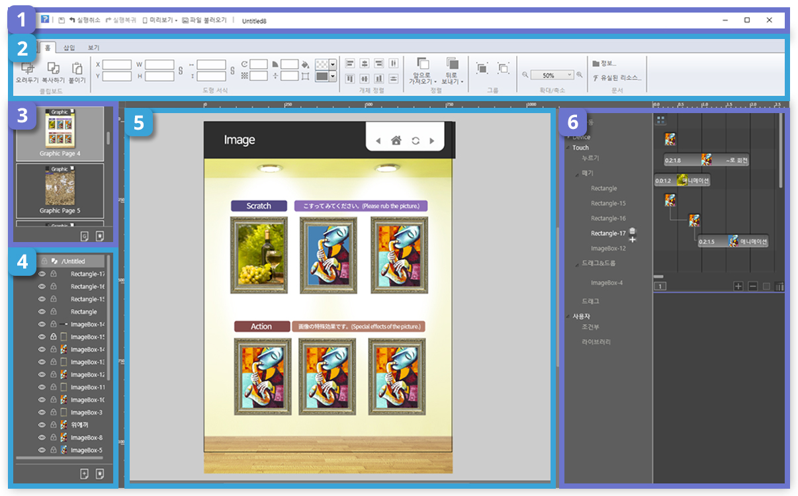

# 3. 페이지 빌더 작업 영역 살펴보기

## 작업 영역 및 패널

페이지빌더는 다음 화면과 같이 5개의 주요 작업 영역으로 구성됩니다. 
화면 구성이 직관적이고 간단하므로 초보 사용자도 쉽게 사용할 수 있습니다. 
숙련된 사용자는 고급 기능을 사용하여 더 빠른 편집이 가능합니다.

### ① 빠른 실행 도구 모음 / 컨트롤 패널

빠른 실행 도구 모음과 컨트롤 패널은 화면 상단에 위치합니다. 

빠른 실행 도구 모음은 저장, 실행 취소, 미리보기 같은 사용자가 자주 사용하는 도구를 표시합니다. 
컨트롤 패널에는 객체를 세부적으로 편집할 때 사용하는 기능들을 담고 있습니다. 예를 들어, 객체의 크기와 위치를 조절하고 색상 설정이 가능합니다.

### ② 페이지 패널

페이지 패널에서는 페이지 목록을 썸네일 이미지로 보여줍니다. 
드래그로 페이지 순서를 재배치 할 수 있으며, 페이지를 추가하거나 삭제 할 수 있습니다.

### ③ 레이어 패널

레이어 패널은 효율적인 편집에 필요한 레이어를 만들거나 삭제할 수 있습니다. 
레이어를 선택하면 레이어에 포함된 객체들의 목록을 보여줍니다. 
이 목록으로부터 그래픽 객체들의 순서를 조절하고 삭제도 가능합니다.

### ④ 작업창

작업창은 화면 중앙에 위치하며 사용자가 편집하는 영역입니다.
작업 영역에 그려진 객체들은 최종 출력에서도 보입니다.
직업 영역 밖에서부터 작업 영역 안쪽으로 이동하는 객체 애니메이션은 이 영역에서만 보입니다.
그리드와 가이드 라인을 적절하게 사용하면 편집에 도움을 받을 수 있습니다.

### ⑤ 액션 패널

액션 패널은 객체에 애니메이션이나 동작 효과 또는 인터랙션을 줄 수 있는 작업 영역입니다. 
적용된 효과를 객체 별로 타임라인에서 볼 수 있습니다. 

 

-----------
