# 4. 컨트롤 패널 살펴보기

컨트롤 패널은 최상단의 탭(홈, 삽입, 보기)에 따라 다른 형태의 리본 메뉴가 나타납니다.
또한 객체의 유형(도형, 이미지박스, 동영상박스 등)에 따라 속성 값을 수정하는 서식 메뉴가 나타납니다.    

- [홈 탭]에서는 객체를 편집하는 도구들을 보여줍니다. 
- [삽입 탭]에서는 도형, 텍스트 박스, 이미지를 삽입하는 도구들을 보여줍니다. 
- [보기 탭]에서는 작업에 도움이 되는 눈금자, 안내선을 보여줍니다.

-------------------------
## 홈 탭 

컨트롤 패널의 기본은 홈 탭 모드입니다. 홈 탭에는 클립보드, 도형 서식, 개체 정렬, 정렬, 그룹, 확대/축소, 문서 정보 같은 객체를 편집하기 위한 다양한 편리 기능이 있습니다. 

### ① 클립보드

- 오려두기: 객체를 지웠다가 다시 붙이는 기능입니다.
- 복사하기: 객체를 복사하는 기능입니다.
- 붙이기: 복사한 것을 붙이는 기능입니다.
   
### ② 도형 서식

- X,Y: 객체의 위치를 나타내며 임의로 지정할 수 있습니다. (단위는 px)
- W,H: 객체의 크기(너비와 높이)를 나타내며 임의로 지정할 수 있습니다. (단위는 px)

1. 회전: 객체에 회전 값을 나타냅니다. (단위는 radian)
2. 불투명도: 객체의 불투명도를 나타냅니다.
3. 라운딩 크기: 사각형 가장자리의 둥근 정도를 나타냅니다.
4. 선 두께: 선의 굵기를 나타냅니다. (단위는 px)
5. 채움 색상: 객체 내부를 원하는 색상으로 채웁니다.
6. 테두리 색상: 객체 테두리의 색상을 나타냅니다.

### ③ 객체 정렬

정렬은 여러개의 레이어 모서리 위치를 맞추거나 간격를 적절하게 지정할 수 있는 도구입니다. 두 개 이상의 레이어를 선택한 후 원하는 방향의 정렬 및 배분 아이콘을 선택하시면 됩니다.  

| 왼쪽 정렬 | 가운데(수직) 정렬 | 오른쪽 정렬 | 수직 중앙 정렬 |
| :-----: | :-----: | :-----: | :-----: |
|  |  |  | |

| 상단 정렬 | 가운데(수평) 정렬 | 하단 정렬 |  수평 중앙 정렬 |
| :-----: | :-----: | :-----: | :-----: |
|  |  |  | |

### ④ 순서 정렬(z-index)

객체를 선택한 후 정렬 아이콘을 선택하시면 객체의 배치 순서를 바꿀 수 있습니다. 

| 현재위치 (2-3-1) | 앞으로 가져오기 (2-1-3) | 맨앞으로 가져오기 (1-2-3) |
| :-----: | :-----: | :-----: |
| 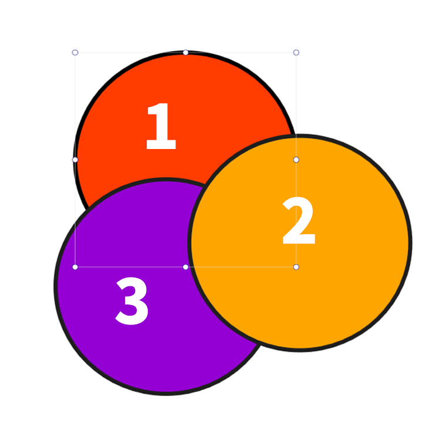 |  |  |
| 현재위치 (1-2-3) | 뒤로 보내기 (2-1-3) | 맨뒤로 보내기 (2-3-1) |
|  |  | 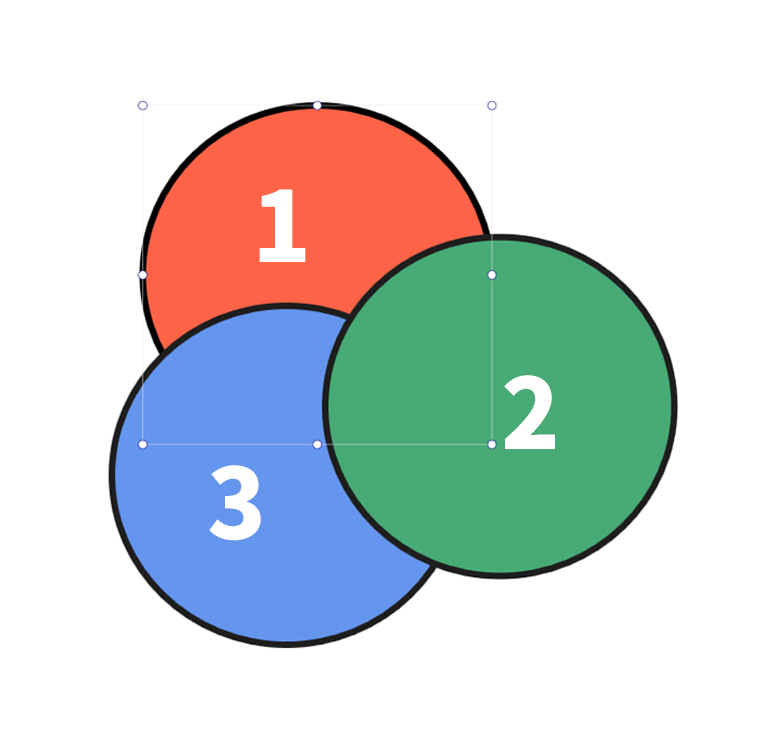 |

객체의 정렬 순서(z-index)는 레이어 패널에서 확인할 수 있으며, 드래그앤드롭으로도 객체 순서를 바꿀 수 있습니다. 

| 현재위치 | 앞으로 가져오기 | 맨앞으로 가져오기 |
| :-----: | :-----: | :-----: |
|  |  |  |

### ⑤ 그룹

그룹은 둘 이상의 객체를 묶어 하나의 객체처럼 다루는 방법입니다.

| 그룹 지정 | 그룹 해제 |
| :-----: | :-----: |
|  |  |

- 그룹 지정: 여러개의 객체를 선택하고 그룹 아이콘을 클릭하면 그룹화 됩니다.
- 그룹 해제: 그룹 해제 아이콘을 클릭하면 그룹이 해제됩니다.

### ⑥ 확대/축소

작업창의 화면을 원하는 비율에 맞게 확대/축소 할 수 있습니다. 

### ⑦ 문서 정보

- 정보 : 페이지 빌더의 버전을 확인할 수 있습니다.
- 유실항목 보기: 유실된 리소스, 액션, 글꼴 목록을 확인할 수 있습니다.
  
유실된 리소스란 페이지빌더 문서에서 참조하고 있으나
실제 존재하지 않는 리소스(이미지 파일, 글꼴)를 의미합니다.

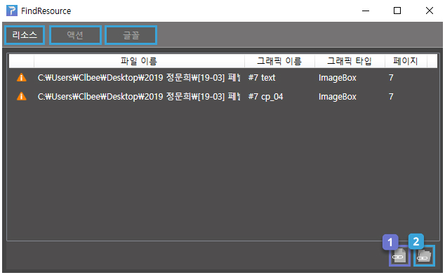

- 1번 아이콘: 유실된 파일을 다른 파일로 대치합니다.
- 2번 아이콘: 폴더 전체의 파일들을 같은 이름의 파일로 대치합니다.

[액션] 항목에서 유실된 액션 효과를 선택하고 하단의 아이콘을 클릭하면 유실된 액션 경로를 찾을 수 있습니다. 

--------

## 삽입 탭

상단 메뉴에서 삽입 탭을 선택하면 다음 그림과 같이 리본 메뉴가 삽입 탭 모드로 바뀝니다. 텍스트박스, 이미지박스, 스크롤, 효과박스, 웹박스, 무비박스를 그릴 수 있습니다. 또한, 다양한 모양의 도형을 그릴 수 있습니다. 

 

### ① 텍스트박스

텍스트 박스는 글 상자입니다. 
텍스트 박스를 선택하면 다음과 같은 텍스트 서식 메뉴가 나타납니다.

폰트의 종류, 폰트 크기 등의 글자 스타일과 들여쓰기, 행 간격 등 단락 스타일을 지정할 수 있습니다. 
옵션의 입력 허용에서 내보내기 시 사용자의 텍스트 입력 허용 여부를 설정할 수 있습니다.

#### 텍스트 입력하기

텍스트 박스를 클릭하고 작업 창에 드래그를 하면 텍스트 박스가 생성됩니다. 
텍스트를 입력하려면 텍스트 박스를 더블 클릭합니다.

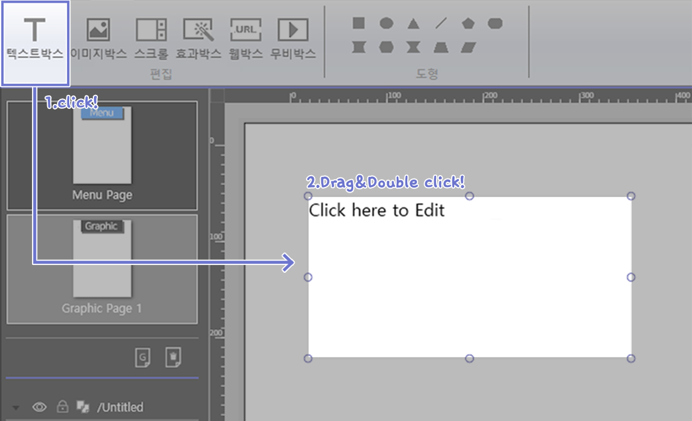

 

### ② 이미지 박스

이미지 박스는 이름 그대로 이미지를 넣을 수 있는 박스입니다.
이미지 박스를 선택하면 이미지 박스의 서식 메뉴가 나타납니다. 

이미지의 크기와 속성을 지정할 수 있습니다. 왼쪽의 옵션 영역의 파일 아이콘을 클릭하면 이미지 파일을 선택할 수 있습니다.  

#### 이미지 넣기

이미지 박스을 클릭하고 작업창에 드래그를 하면 이미지 박스가 생성됩니다. 

이미지 박스 선택 후 이미지 박스 서식 메뉴에서 왼쪽에 있는 파일 아이콘을 선택하면 이미지를 열 수 있습니다. 

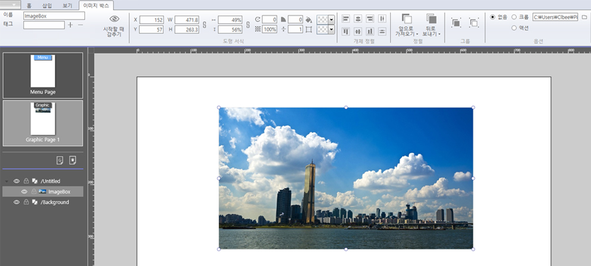

이미지 박스 서식 메뉴에서 크롭, 액션 설정이 가능합니다.  
(현재 지원하는 이미지 형식은 PNG, JPG, GIF입니다) 

### 이미지 자르기

이미지 박스 서식 메뉴에서 '크롭'을 선택한 후 이미지 포인터를 드래그하여 이미지 크기를 조절할 수 있습니다.  

### 이미지에 액션 효과 주기

이미지에 다양한 액션 효과를 줄 수 있습니다.

- 푸쉬: 첫번째 이미지를 누르면 두번째 이미지를 보여줍니다
- 토글: 이미지를 클릭할 떄마다 두가지 이미지를 번갈아 보여줍니다.
- 깜빡거림: 첫번째 이미지와 두 번째 이미지가 번갈아 보여줍니다. 속도와 동작 시간을 조절할 수 있습니다.
- 스크래치1: 첫번째 이미지가 스크래치를 통해 지워지고 두번째 이미지가 나타납니다.
- 스크래치2: 이미지가 스크래치를 통해 지워집니다.
- 스크래치3: 스크래치를 통해 선택된 색상이 칠해집니다. 
 

### ③ 스크롤 박스

스크롤 박스 기능으로 화면의 스크롤 영역 크기를 조절할 수 있습니다. 
'페이징' 체크 박스를 선택하시면 스크롤 모드에서 페이지 넘김 효과를 사용할 수 있습니다. 
또한 가로, 세로 버튼으로 스크롤의 방향 선택이 가능합니다. 

### 스크롤 페이징하기

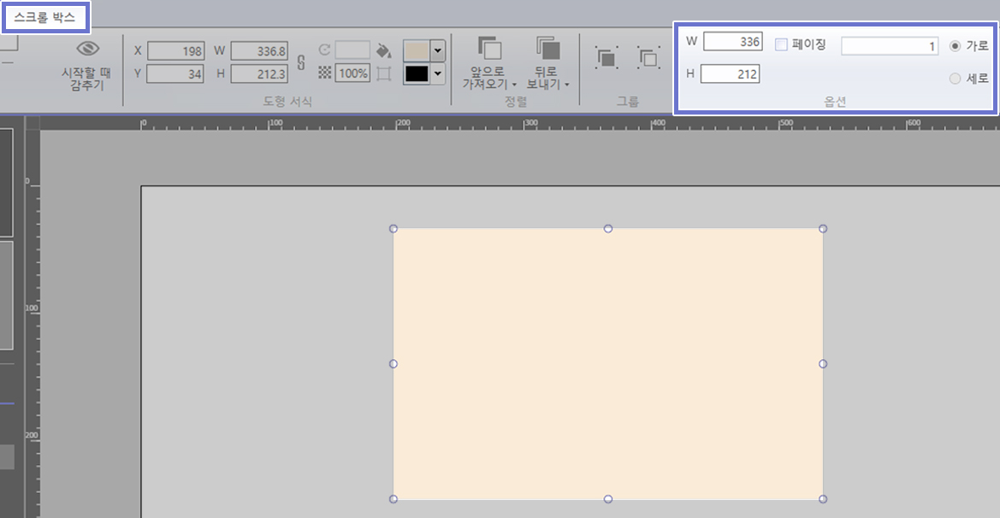

스크롤 박스 서식 메뉴의 옵션에서 페이징을 선택한 뒤 페이지 개수를 입력합니다.        

스크롤 박스를 더블클릭하면 현재 페이지의 편집 화면이 나타납니다.
(작업창의 왼쪽 상단 화살표를 클릭하면 편집 상태를 나갈 수 있습니다.)

 

### ④ 효과 박스

효과 박스탭 모드에서 객체에 특수 효과를 넣을 수 있습니다.

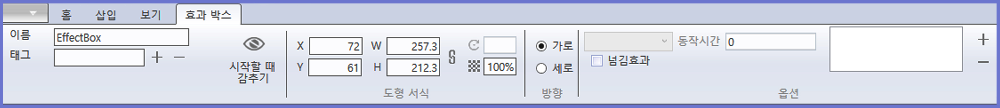

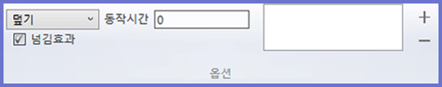

'넘김 효과' 체크박스를 선택하면 효과 옵션을 선택할 수 있습니다. 

넘김 효과로는 덮기, 나타내기, 밀어내기, 당기기가 있습니다. '동작시간'에서 페이지를 넘길 때 효과의 지속 시간을 지정할 수 있습니다.

 

### ⑤ 웹 박스

웹 박스 모드에서는 웹 사이트를 작업창에 가져올 수 있습니다. 
웹 박스 선택 후 웹 박스 서식 메뉴에서 URL 입력 박스에 웹 주소를 입력하면 됩니다.

### URL 주소 넣기

웹박스를 선택한 후 작업창에 드래그를 합니다.

드래그한 박스를 더블 클릭 한 후 웹박스 서식 메뉴에서 URL 입력 박스에 웹 주소를 입력합니다.

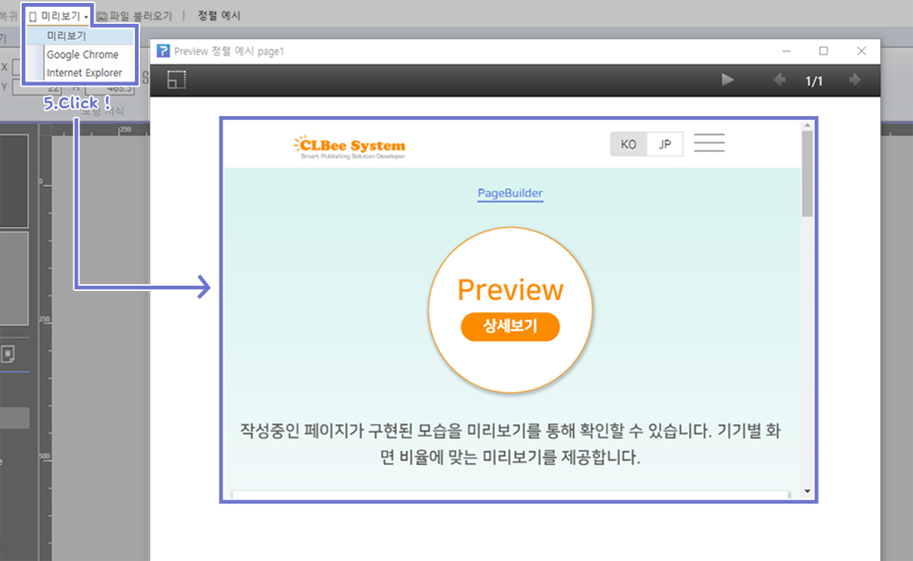

미리보기를 선택한 후 미리보기 창에서 URL 주소의 웹 사이트를 볼 수 있습니다. 

 

### ⑥ 무비 박스

무비 박스 모드에서는 작업창에 동영상 파일 재생이 가능합니다. 
무비 박스 선택 후 경로 파일 아이콘을 체크하시면 영상 선택이 됩니다. 
무비 박스 서식 메뉴에서 영상의 크기와 위치를 지정할 수 있습니다.  

 

### ⑦ 도형

도형을 선택하면 컨트롤 패널에 도형 서식 메뉴가 나타납니다. 
도형의 크기, 위치, 회전, 투명도, 선 두께 등이 표시되며 값을 지정할 수 있습니다. 
또한 도형의 정렬, 그룹화 등의 속성을 다룰 수 있습니다.

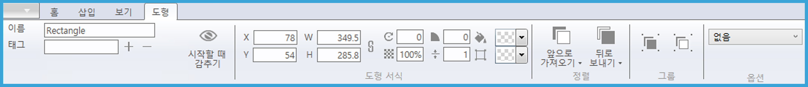

옵션에서 푸시와 깜박거림 효과를 선택 할 수 있습니다. 

 

| 푸쉬 | 깜박거림 |
| :-----: | :-----: |
|  |  |

- 푸쉬: 도형을 누르고 있는 동안은 도형이 반투명해집니다.
- 깜박거림: 도형이 깜빡거리는 동작시간과 속도를 지정할 수 있습니다.

-----
## 보기 탭

컨트롤 패널의 보기 모드는 눈금자 숨기기, 안내선 보기, 박스선에 붙이기, 안내선에 붙이기를 지원합니다. 
이러한 기능들은 편집을 좀 더 쉽고 빠르게 하는데 도움을 줍니다.

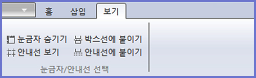

---
