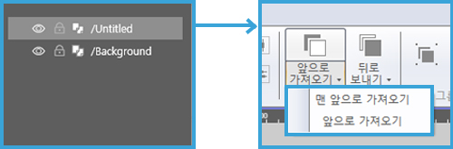
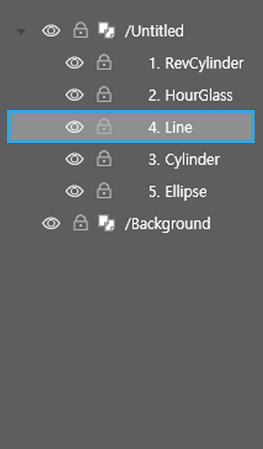
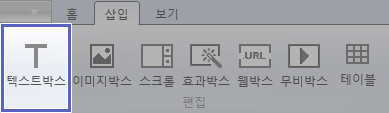
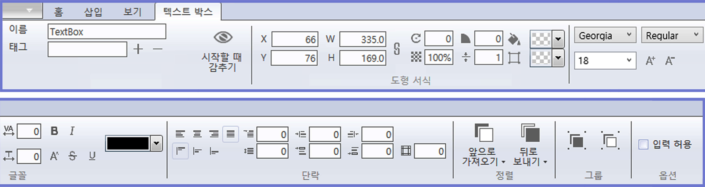
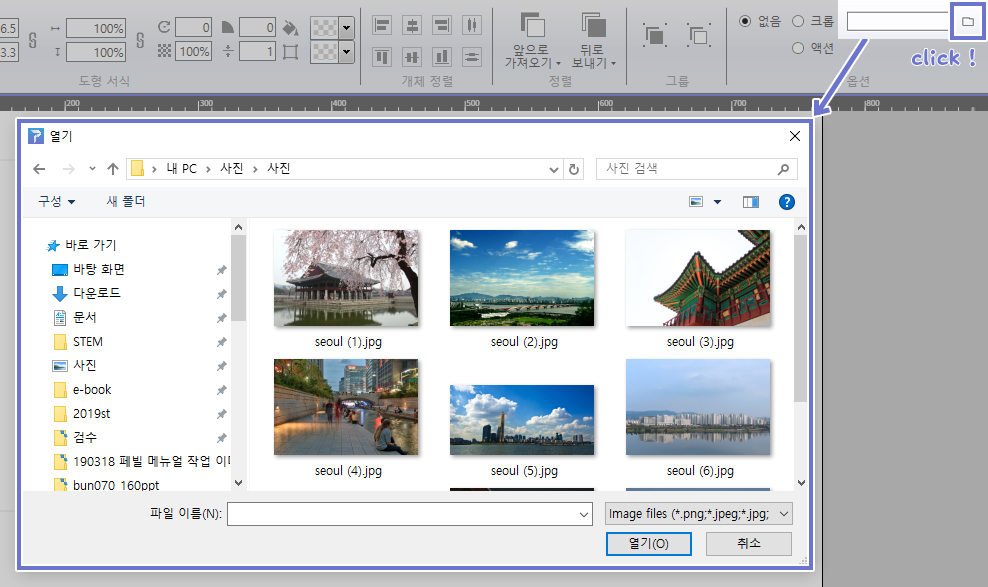
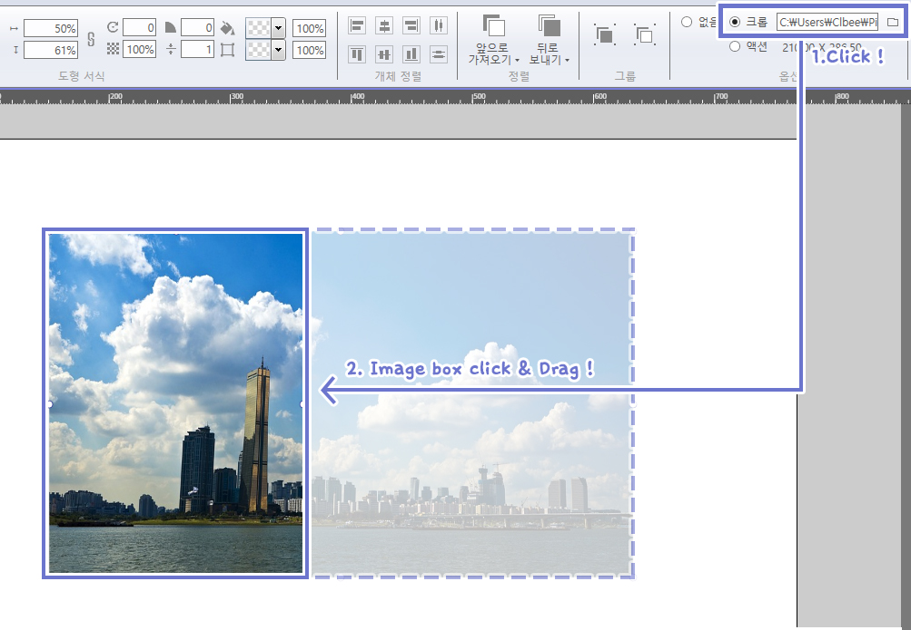
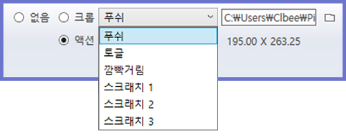
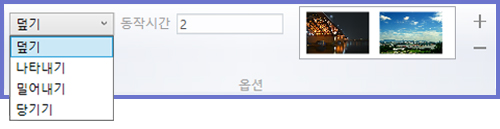
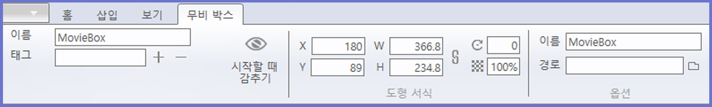

# 컨트롤 패널

인스펙터 패널은 최상단의 메뉴(홈, 삽입, 보기)에 따라 다른 형태의 패널을 보여줍니다. 또한 선택한 객체(도형, 이미지, 동영상 등)에 따라 해당하는 인스펙터가 나타납니다.

- 홈 모드에서는 객체를 편집하는 도구들을 보여줍니다. 
- 삽입 모드에서는 도형, 텍스트 박스, 이미지를 삽입하는 도구들을 보여줍니다. 
- 보기 모드에서는 작업에 도움이 되는 눈금자, 안내선 등을 보여줍니다.

-------------------------
## 홈 모드

컨트롤 패널의 기본은 홈 모드입니다. 여기에서는 객체를 편집하기 위한 다양한 인스펙터들을 보여줍니다.

.jpg)

### ① 클립보드

- 오려두기 : 객체를 자르고 붙이는 기능입니다.
- 복사하기 : 객체를 복사하는 기능입니다.
- 붙이기 : 복사한 것을 붙이는 기능입니다.
   
### ② 도형 서식

- X,Y: 객체의 위치를 나타내며 임의로 지정할 수 있습니다.
- W,H: 객체의 크기를 나타내며 임의로 지정할 수 있습니다.

1. 회전: 객체에 회전 값을 나타냅니다.
2. 불투명도: 객체의 불투명도를 나타냅니다.
3. 라운딩 크기: 사각형 가장자리의 둥글기를 나타냅니다.
4. 선분 두께: 선의 굵기를 나타냅니다.
5. 채움 칼라: 객체 내부의 칼라를 나타냅니다.
6. 테두리 칼라: 객체 테두리의 칼라를 나타냅니다.

### ③ 객체 정렬

객체를 선택하여 레이아웃의 정렬을 지정할 수 있습니다.

### ④ 정렬

객체를 선택한 뒤 정렬 아이콘을 클릭하면 배치 순서를 바꿀 수 있습니다.

#### 객체를 앞으로 가져오려면

객체의 정렬 순서(z-index)는 레이아웃 상에서 드래그앤드롭으로도 가능합니다.

| 오리지널 | 앞으로 가져오기 | 맨앞으로 가져오기 |
| :-----: | :-----: | :-----: |
|  |  |  |

#### 객체를 뒤로 가져오려면

위와 비슷한 방식으로 객체의 순서를 조절할 수 있습니다.

### ⑤ 그룹

그룹 지정 : 여러개의 객체를 선택하여 그룹으로 지정합니다.
그룹 해제 : 그룹을 해제합니다

### ⑥ 확대/축소

작업 화면의 확대/축소를 조절합니다.

### ⑦ 문서

- INFO: 페이지 빌더의 버전을 확인할 수 있습니다.
- 유실항목 보기: 유실된 리소스, 액션, 글꼴 목록을 확인할 수 있습니다.

- 1번 아이콘 - 유실된 파일을 다른 파일로 대치합니다.
- 2번 아이콘 - 폴더 전체의 파일들을 같은 이름의 파일로 대치합니다

----------------------
## 삽입 모드

메뉴에서 삽입 탭을 선택하면 인스펙터 패널은 삽입 모드로 바뀝니다.

### ① 편집

예를들어 텍스트 박스 버튼을 클릭하고 작업 영역에 드래그를 하면 텍스트 박스가 생성됩니다.

텍스트 박스가 선택되면 컨트롤 패널은 텍스트 박스 인스펙터가 됩니다.

### [텍스트 박스 인스펙터]

여기에서 폰트의 종류, 폰트 크기 등의 텍스트 스타일과 인덴테이션, 행 간격 등 단락 스타일을 지정할 수 있습니다.

옵션에서는 내보내기 했을 때 사용자의 텍스트 입력 허용 여부를 설정합니다.

### [이미지 박스 인스펙터]

컨트롤 패널은 텍스트 박스와 마찬가지로 이미지가 선택하면 이미지 박스의 인스펙터로 바뀝니다.

여기에서는 이미지의 크기 조정과 속성을 선택할 수 있습니다. 왼쪽의 옵션 영역의 파일 아이콘을 클릭하면 이미지 파일을 선택할 수 있습니다.  

이미지 파일을 선택하면 작업 공간에 이미지 박스가 표시됩니다.

또한 크롭, 액션 설정이 가능합니다.
(현재 지원하는 이미지 형식은 PNG, JPG, GIF입니다) 

### 이미지 자르기

옵션 영역의 크롭을 선택한 후 이미지 포인터를 드래그하여 이미지 크기를 조정하면
이미지 자르기 편집이 가능합니다.

### 이미지에 액션 효과 주기

이미지에 다양한 액션 효과를 줄 수 있습니다.

- 푸쉬: 첫번째 이미지를 누르면 두번째 이미지를 보여줍니다
- 토글: 이미지를 클릭할 떄마다 두가지 이미지를 번갈아 보여줍니다.
- 깜빡거림: 첫번째 이미지와 두 번째 이미지가 번갈아 보여줍니다. 속도와 동작 시간을 조절할 수 있습니다.
- 스크래치1: 첫번째 이미지가 스크래치를 통해 지워지고 두번째 이미지가 나타납니다.
- 스크래치2: 이미지가 스크래치를 통해 지워집니다.
- 스크래치3: 스크래치를 통해 선택된 색상이 칠해집니다.

### [스크롤 박스 인스펙터]

스크롤 모드에서 스크롤 영역의 크기를 조정할 수 있습니다. 페이징 체크 박스로 스크롤 모드에서의 페이지 넘김 효과를 사용할 수 있습니다. 또한 가로,세로 버튼으로 스크롤의 방향을 결정할 수 있습니다.

옵션 영역에서 페이지 체크박스를 선택한 뒤 페이지 개수를 입력합니다.

스크롤 박스를 더블클릭하면 페이지가 두개인 편집 화면이 나타납니다. (편집 화면에서 나가려면 왼쪽 상단의 화살표를 클릭)

### [효과 박스 인스펙터]

효과 박스 모드에서는 객체에 특수 효과를 넣을 수 있습니다.

'넘김 효과' 체크박스를 선택하면 옵션을 선택할 수 있다.

넘김 효과로는 덮기, 나타내기, 밀어내기, 당기기가 있습니다.

'동작시간'은 페이지를 넘길 때 효과의 지속 시간을 지정할 수 있습니다.

### [웹 박스 인스펙터]

웹박스 모드에서는 웹 사이트를 박스에 담을 수 있습니다. URL 입력 박스에 웹 주소를 입력합니다. '유투브' 체크박스를 클릭하면 youtube 주소에 대해서는 동영상만 표시되도록 합니다. 

### [무비 박스 인스펙터]

무비 박스 모드에서는 동영상 파일을 로드하고 박스의 크기와 위치 경로를 지정할 수 있습니다. 

### [도형 인스펙터]

도형을 선택하면 컨트롤 패널에 도형 인스펙터가 나타납니다. 도형의 크기, 위치, 회전, 투명도, 선 두께 등이 표시되며 값을 지정할 수 있습니다. 
또한 도형의 정렬, 그룹화 등의 속성을 다룰 수 있습니다.

옵션을 선택하여 옵션의 속성을 조절할 수 있습니다.

- 푸쉬 : 도형을 누르고 있는 동안은 도형이 반투명해집니다
- 깜박거림 : 도형이 깜빡거리는 동작시간과 속도를 지정합니다.

-----
## 컨트롤 패널 - 보기 모드

컨트롤 패널의 보기 모드는 눈금자 숨기기, 안내선 보기, 박스선에 붙이기, 안내선에 붙이기를 지원합니다. 이러한 기능들은 편집을 좀 더 쉽고 빠르게 하는데 도움을 줍니다.

