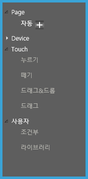
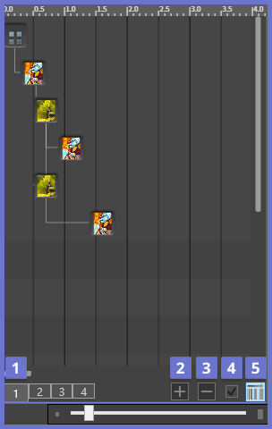
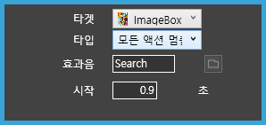
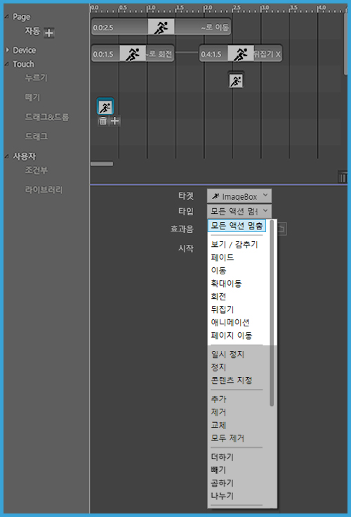
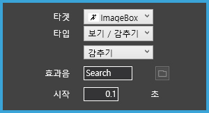
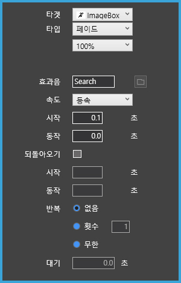
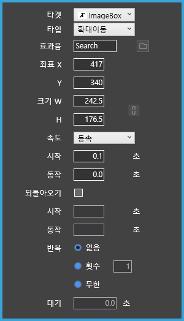
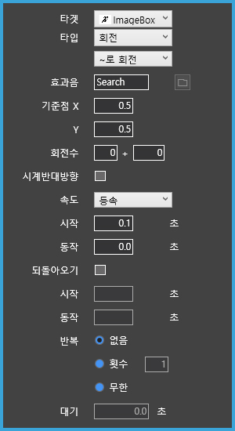

# 5. 액션 패널 살펴보기

액션은 페이지빌더의 핵심 기능 중에 하나로서 그래픽 애니메이션과 사용자와의 인터랙션을 처리합니다. 
액션 패널에서는 시간의 흐름에 따른 액션을 지정할 수 있습니다. 
객체에 적용할 수 있는 다양한 애니메이션 효과와 자동실행, 누르기(mouse down), 떼기(mouse up)와 같은 다양한 액션 기능을 제공합니다. 

-----

### 액션 패널 기본 정보

액션 패널은 액션 컨트롤러, 타임라인 상태표시, 액션 속성 창으로 구성됩니다. 

 

### ① 액션 컨트롤러

액션 컨트롤러에는 Page, Device, Touch, 사용자와 같은 특정한 동작에 필요한 액션을 표시됩니다.

> 모드별 액션 설명

|모드|액션|
|----------|-----------------|
|Page|<li>**자동**: 페이지 실행시 자동으로 실행됩니다.</li>|
|Device|<li>**흔들기**: 디바이스를 흔들면 액션이 실행됩니다. </li><li>**불기**: 소리가 입력되면 액션이 실행됩니다. </li>
|Touch|<li>**누르기**: 객체를 누르면 액션이 실행됩니다.</li> <li>**떼기**: 객체에서 버튼 업 상태에서 액션이 실행됩니다. </li> <li>**드래그&드롭**: 객체를 다른 곳으로 끌어다 놓을 때 액션이 실행됩니다. </li> <li>**드래그**: 객체를 드래그 할 때 액션이 실행됩니다.</li>|
|사용자|<li>**조건부-라이브러리**: 라이브러리에 액션 속성을 저장해 액션을 재사용 할 수 있습니다.</li>|

### ② 타임라인 상태표시

타임라인에서는 시간의 흐름에 따라 액션을 표시합니다. 타임라인 작업 창에서 액션을 편집하거나, 액션 적용 시간을 수정할 수 있습니다. 

- 1번 시퀀스: 시퀀스
- 2번 시퀀스 추가: 시퀀스를 추가할 수 있습니다.
- 3번 시퀀스 삭제: 시퀀스를 삭제할 수 있습니다. 
- 4번 아이콘: 
- 5번 타임라인 뷰 확대/ 축소: 슬라이더를 사용하여 타임라인에 보여지는 시간 축의 너비를 조정합니다. 

### ③ 액션 속성 창

객체에 적용된 액션 타입에 따라 세부 속성 값이 나타납니다. 속성 값을 변경하여 액션을 다양하게 나타낼 수 있습니다. 

- 타겟 : 액션의 타켓을 정합니다.
- 타입 : 타켓의 액션을 정합니다. 드롭다운메뉴를 선택하면 다양한 타입의 종류가 나타납니다. 

 

### 액션 지정하기

액션을 지정하려면 먼저 액션을 나타낼 객체를 선택하고 액션 타입을 선택하면 됩니다. 
액션 효과는 객체(또는 그룹화된 객체)에게 자동으로 또는 사용자의 반응에 따라 움직임을 줄 수 있습니다. 

 

###  액션 타입 살펴보기

액션 타입에서 다양한 액션 효과를 선택할 수 있습니다. 

   

 

- '모든 액션 멈춤': 모든 액션의 동작을 멈춥니다. 효과음(mp3 파일)과 시작 지연 시간을 지정할 수 있습니다.
  
    

- '보기/감추기': 객체를 화면에서 보이거나 숨깁니다. 효과음과 시작 지연 시간을 지정할 수 있습니다.

  
  
    |예시|
    |:---:|
    |
 
- '페이드': 객체의 불투명도를 조절합니다. 다음과 같은 애니메이션 속성을 지정할 수 있습니다.
  
   

  - 100%/0%/입력: 불명도를 조절합니다.
  - 속도: 애니메이션 속도를 조절합니다.
  - 동작 시간: 액션의 동작 시간을 나타냅니다.
  - 되돌아오기: 액션을 거꾸로 동작할지 여부를 선택합니다.
  - 반복 횟수: 동작의 반복 횟수를 지정합니다.
  

- '이동': 객체를 이동시킵니다.
  
   

  - '~로 이동/~만큼 이동/곡선 이동': 이동 방법을 선택합니다.
  - 'x축 이동, y축 이동': 입력한만큼 x축과 y축으로 이동합니다.

- '확대이동': 객체의 크기를 조절하고 이동합니다.

   

  - 좌표 X, Y: 객체가 이동할 X,Y 좌표를 나타냅니다.
  - 크기 W, H: 확대한 크기 W, H를 나타냅니다.

- '회전': 객체를 회전시킵니다.

   

  - ~로 회전, ~만큼 회전: 회전방법을 선택합니다.
  - 기준점 X, Y: 회전의 기준점이 되는 좌표를 정합니다.
  - 회전 수: 회전 횟수를 지정합니다.
  - 시계반대방향: 시계 반대방향으로 회전합니다

- '뒤집기': 객체를 가로,세로 방향으로 뒤집습니다.

   

  - 가로 뒤집기/세로 뒤집기: 뒤집기의 방향을 정합니다.
  - 효과음: 효과음을 넣을 수 있습니다.

- '애니메이션': 객체에 이미지를 넣어 연속된 동작으로 보여줍니다.
  
   

  - 이미지: 애니메이션 효과를 적용할 이미지들을 불러옵니다.
  - 되돌아오기: 액션을 거꾸로 동작할지 여부를 선택합니다
  - 초기값 복원: 애니메이션이 끝나면 초기에 넣었던 이미지로 돌아갑니다.

- '페이지 이동': 페이지를 지정하여 이동합니다.
  
   
  
  - 다음 페이지: 다음 페이지로 이동합니다.
  - 이전 페이지: 이전 페이지로 이동합니다.
  - 보던 페이지: 보던 페이지로 이동합니다.
  - 홈: 홈으로 이동합니다.
  - 입력: 입력한 페이지로 이동합니다.
 
 ---
 
