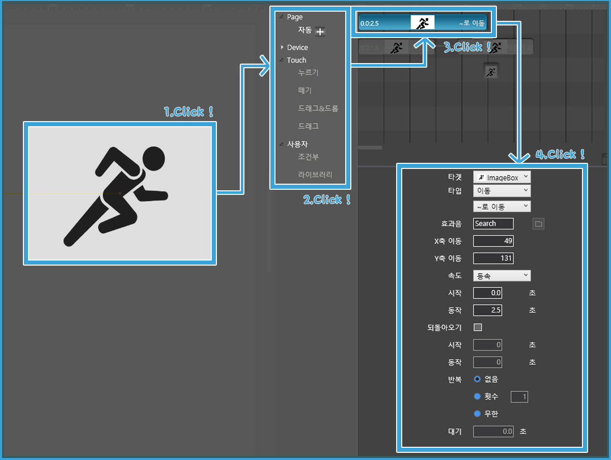

# 5. 페이지 빌더 기본 기능 살펴보기 - 액션 패널

타임라인은 페이지빌더의 핵심 기능 중에 하나로서 시간의 흐름에 따른 액션을 지정할 수 있습니다. 객체에 적용할 수 있는 다양한 액션들과 더불
어 자동실행, 누르기, 떼기와 같은 다양한 액션 트리거 기능을 제공합니다.

 

 타임라인 패널 영역은 다음 4가지 영역으로 나뉩니다.

### ① 액션 컨트롤러

Page, Device, Touch, 사용자에 대한 특정한 동작에 필요한 액션을 표시합니다.

> 액션 트리거의 타입

|모드|옵션|
|----------|-----------------|
|Page|자동: 페이지 실행시 자동으로 실행됩니다.|
|Device|흔들기: 디바이스를 흔들면 액션이 실행됩니다. 
||불기: 소리가 입력되면 액션이 실행됩니다. 
|Touch|누르기: 객체를 누르면 액션이 실행됩니다.
||떼기: 객체에서 손을 뗄 때 액션이 실행됩니다
||드래그&드롭: 객체를 다른 곳으로 끌어다 놓을 때 액션이 실행됩니다.
||드래그: 객체를 드래그 할 때 액션이 실행됩니다.|
|사용자|조건부-라이브러리: 라이브러리에 액션 속성을 저장해 액션을 재사용 할 수 있습니다.|

### ② 타임라인 상태표시

타임라인 뷰의 액션을 시간의 흐름에 따라 표시합니다. 

(1) 슬라이더를 사용하여 타임라인에 보여지는 시간 축의 너비를 조정합니다.

### ③ 액션 인스펙터

액션의 세부 속성을 나타냅니다. (글 수정) 

### 액션 인스펙터 알아보기

액션 인스펙터는 객체(또는 그룹화된 객체)에게 자동으로 또는 사용자의 반응에 따라 움직임을 갖는 객체를 만드는  도구입니다.

액션을 지정하려면 먼저 액션의 타깃과 액션 타입을 정해야 합니다. 

액션 타입은 다음과 같습니다.

   

   
 
  - '모든 액션 멈춤': 모든 액션의 동작을 멈춥니다. 효과음(mp3 파일)과 시작 지연 시간을 지정할 수 있습니다.
  
    

- '보기/감추기': 객체를 화면에서 보이거나 숨깁니다. 효과음과 시작 지연 시간을 지정할 수 있습니다.

  
 
- '페이드': 객체의 불투명도를 조절합니다. 다음과 같은 애니메이션 속성을 지정할 수 있습니다.
  
   

  - 100%/0%/입력: 불명도를 조절합니다 
  - 속도: 애니메이션 속도를 조절합니다.
  - 동작 시간: 액션의 동작 시간을 나타냅니다.
  - 되돌아오기: 액션을 거꾸로 동작할지 여부를 선택합니다
  - 반복 횟수: 동작의 반복 횟수를 지정합니다.
- '이동': 객체를 이동시킵니다.
  
   

  - ~로 이동/~만큼 이동/곡선 이동: 이동 방법을 선택합니다.
  - x축 이동, y축 이동 : 지정한만큼 x축과 y축으로 이동합니다.

- '확대이동': 객체의 크기를 조절하고 이동합니다.

   

  - 좌표 X, Y : 객체가 이동할 X,Y 좌표를 나타냅니다.
  - 크기 W, H : 확대한 크기 W, H를 나타냅니다.

- '회전': 객체를 회전시킵니다.

   

  - ~로 회전, ~만큼 회전 : 회전방법을 선택합니다.
  - 기준점 X, Y : 회전의 기준점이 되는 좌표를 정합니다.
  - 회전 수 : 회전 횟수를 지정합니다.
  - 시계반대방향: 시계 반대방향으로 회전합니다

- '뒤집기': 객체를 가로,세로 방향으로 뒤집습니다.

   

  - 가로 뒤집기/세로 뒤집기 : 뒤집기의 방향을 정합니다.
  - 효과음 : 효과음을 넣을 수 있습니다.

- 애니메이션 : 객체에 이미지를 넣어 연속된 동작으로 보여줍니다.
  
   

  - 이미지: 애니메이션 효과를 적용할 이미지들을 불러옵니다.
  - 되돌아오기: 액션을 거꾸로 동작할지 여부를 선택합니다
  - 초기값 복원: 애니메이션이 끝나면 초기에 넣었던 이미지로 돌아갑니다.

- 페이지 이동 : 페이지를 지정하여 이동합니다.
  
   
  
  - 다음 페이지 : 다음 페이지로 이동합니다.
  - 이전 페이지 : 이전 페이지로 이동합니다.
  - 보던 페이지 : 보던 페이지로 이동합니다.
  - 홈 : 홈으로 이동합니다.
  - 입력 : 입력한 페이지로 이동합니다.
 